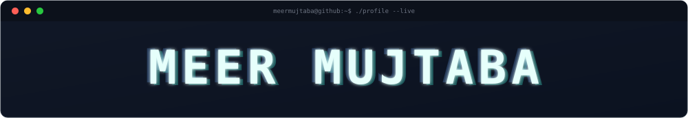
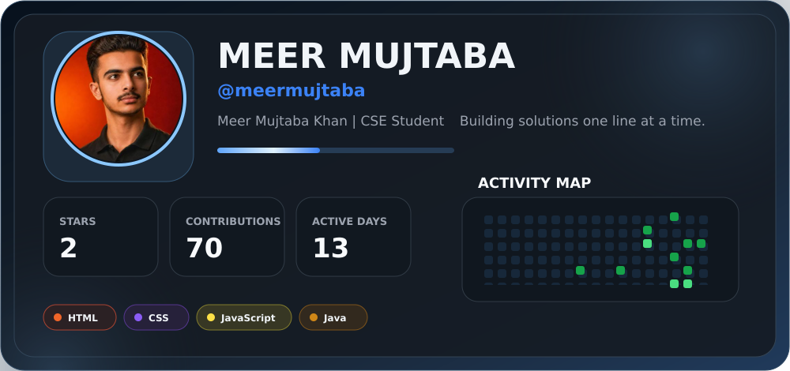
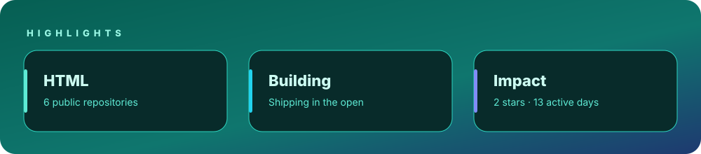
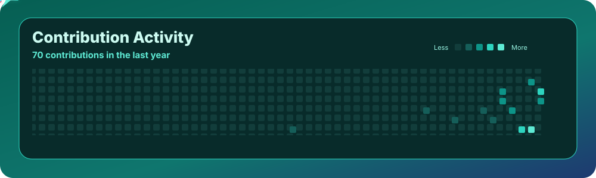
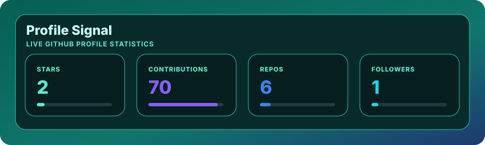
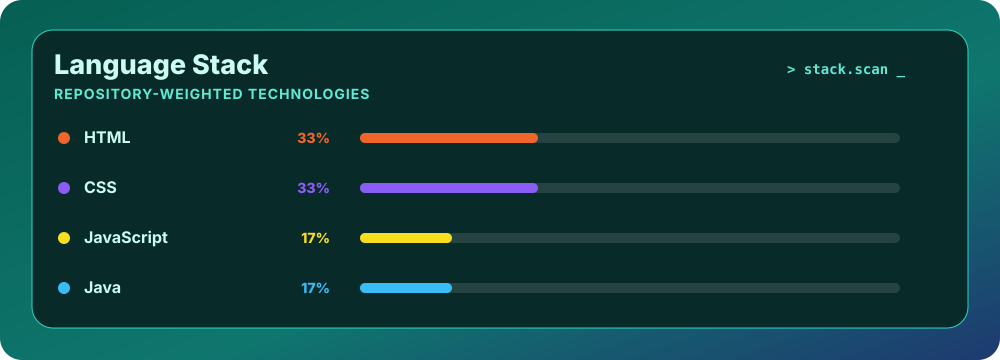
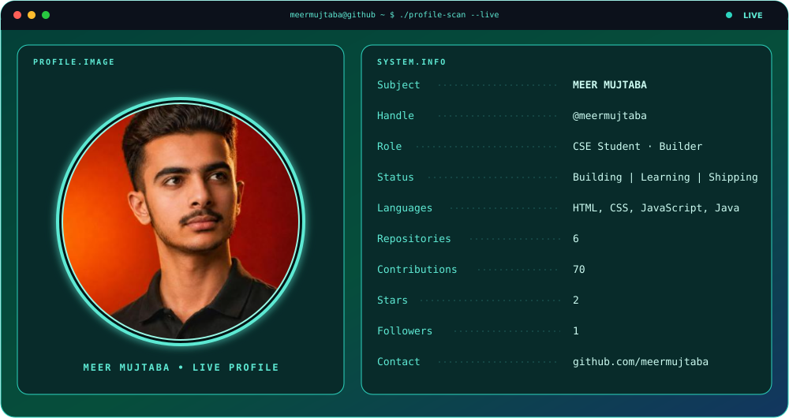

<!--
  GitHub Profile README
  The card values below follow the supplied reference for Meer Mujtaba.
  Keep the assets folder beside README.md when uploading to GitHub.
-->

<h2>
  <a href="https://github.com/meermujtaba">GitHub</a>
  ·
  <a href="https://github.com/meermujtaba?tab=repositories">Projects</a>
</h2>

## The year, so far

## Signal

## Profile scan

